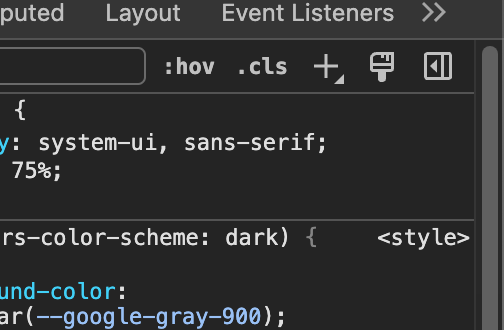
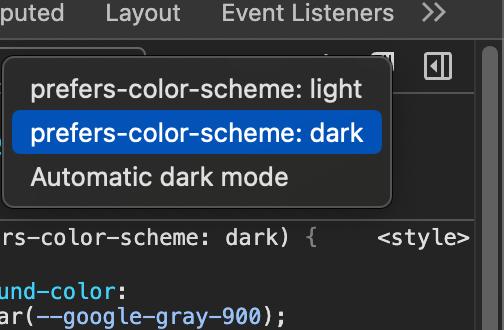

This demonstrates an styling issues as relates to SSR and user preference media queries. 

## Instruction


```
npm i 
npm run dev
```


Navigate to localhost:3000/my-page

Open dev tools and force color preference via the paint brush icon in the elements tab



